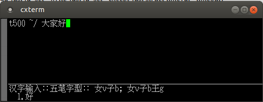
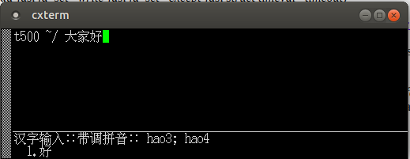

## cxterm 5.3.1 released on 2020/6/26.

cxterm source code has stayed on http://cxterm.sourceforge.net for 
quite some years, but it somehow failed to work with Ubuntu Linux recently.

I tried to make it work again on Ubuntu 18.04, by commenting out VEOL2, 
and VLNEXT lines in main.c . Later, Hin-Tak Leung informed me it is "termios"
problem in main.c in fact. So I reverted VEOL2/VLNEXT.

Hin-Tak Leung is also maintaining: https://github.com/HinTak/cxterm .

Ubuntu's default locale is `zh_CN.UTF-8`. Yes, UTF8 is more popular. If you 
use GB encoding, you may need add GB2312 locale: 

Login as root, add one line `"zh_CN GB2312"` to file: 

    /var/lib/locales/supported.d/local

then run command:

    locale-gen --purge

And add following to your ~/.bashrc:

    if [ "$CHAR_ENCODING" == "GB" ]; then
	    export LC_CTYPE=zh_CN.GB2312
    fi

I don't have time/knowledge to get it working with UTF8 or GBK locale
at this moment.

Double hit F# key will show the corresponding input "codes" of last
entered Chinese character.

For UTF8 to GB2312 cross converting, I put the following in my ~/.bashrc:

    alias u82gb='iconv -f utf8 -t gb2312'
    alias gb2u8='iconv -t utf8 -f gb2312'

## zsh, better bash ?

By the way, I recently found zsh to be better than bash, at least at
handling "/" in directory/symlink arguments when TAB is pressed. 
The following 2 commands will give you totally different results 
under bash (at Ubuntu 18.04 default configuration):

    /bin/rm -fr some_sym_link_to_dir

and:

    /bin/rm -fr some_sym_link_to_dir/

zsh handles "/" smartly, it will show you, but strip it off when 
running command.

## 中文

cxterm 的源码存在于http://cxterm.sourceforge.net, 有些年头了，但最近不再能
用于ubuntu 18.04。本次修复了一下。重新发布于gitee.com . 双击F#键，可以显示
最近输入的一个中文的编码。 iconv 可以在utf8与gb2312间互相转码.

## To Do:

- Let it read/save UTF8 encoded files directly.
